# SNP Data Fetcher - NCBI API TEST

## Descrição do Script

Este repositório contém um script Python simples e direto, projetado para buscar e organizar dados de SNPs (Polimorfismos de Nucleotídeo Único) de forma eficiente. Utilizando a API do NCBI, o código acessa o banco de dados dbSNP para obter informações detalhadas sobre SNPs, como ID, cromossomo, posição, gene associado, significância clínica e frequências alélicas. As informações são organizadas e exibidas em tabelas formatadas, facilitando a análise e interpretação de dados genéticos.

## Diagrama de Fluxo da Aplicação

Abaixo, você encontra um diagrama de fluxo que detalha o funcionamento do script.



## Aviso Importante

Os SNP IDs utilizados no script `ncbiapirest_test.py` estão definidos de forma fixa (hardcoded). Certifique-se de editar o código caso precise consultar IDs diferentes.

## Funcionalidades

- **Busca de dados de SNP**: Através do ID de SNP fornecido, o script consulta a API do NCBI e obtém um resumo dos dados em formato XML.
- **Análise de dados XML**: Extrai informações relevantes do XML, como ID do SNP, cromossomo, posição, nome e ID do gene associado, significância clínica e frequências alélicas.
- **Apresentação de dados**: Os dados extraídos são organizados em dois DataFrames: um para informações gerais do SNP e outro para as frequências alélicas (MAF - Minor Allele Frequency).

## Requisitos

Certifique-se de ter as seguintes bibliotecas instaladas:

- `requests`: para fazer as requisições HTTP à API do NCBI.
- `xml.etree.ElementTree`: para analisar os dados XML retornados pela API.
- `pandas`: para organizar e exibir os dados em formato tabular.

Instale-as utilizando o comando:

```bash
pip install requests pandas
```

## Primeiros Passos

Para executar o script, siga as instruções abaixo:

1. Clone este repositório para o seu ambiente local:
   ```bash
   git clone https://github.com/seu-usuario/snp-data-fetcher.git
   ```
2. Acesse o diretório do projeto:
   ```bash
   cd snp-data-fetcher
   ```
3. Instale as dependências necessárias:
   ```bash
   pip install -r requirements.txt
   ```
4. Execute o script:
   ```bash
   python ncbiapirest_test.py
   ```

## Exemplo de Erro de Conexão

Caso o script não consiga acessar a API do NCBI devido a problemas de rede ou firewall, você pode encontrar a seguinte mensagem de erro:

- **HTTP Status Code 503:** This indicates that the NCBI API server is currently unavailable.
- **Message:** A descriptive message provided by the server or the script explaining the issue.

Certifique-se de verificar sua conexão com a internet e suas configurações de proxy ou firewall antes de tentar novamente.

## Exemplo de Uso

Ao executar o script com o SNP ID 334, a saída gerada é semelhante a:

```
Informações Gerais do SNP:
| Property              | Value     |
|-----------------------|-----------|
| SNP_ID                | 334       |
| CHR                   | 1         |
| POSITION              | 1234567   |
| GENE_NAME             | ABCD1     |
| GENE_ID               | 1234      |
| CLINICAL_SIGNIFICANCE | Benign    |

Tabela de Frequências Alélicas:
| Study   | Frequency |
|---------|-----------|
| Study1  | 0.1       |
| Study2  | 0.2       |
```

## Estrutura do Repositório

- `ncbiapirest_test.py`: Script principal para buscar e organizar dados de SNPs.
- `requirements.txt`: Lista de dependências necessárias para o projeto.
- `README.md`: Documentação do projeto.
- `snp_data_fetcher_diagram.png`: Diagrama de fluxo da aplicação.
- `image001.png`: Exemplo de erro de conexão.

## Contribuindo

Se você deseja contribuir com este projeto, siga as diretrizes abaixo:

1. Faça um fork deste repositório.
2. Crie uma nova branch para a sua feature:
   ```bash
   git checkout -b feature/nova-feature
   ```
3. Faça o commit das suas alterações:
   ```bash
   git commit -m 'Adiciona nova feature'
   ```
4. Envie para o repositório remoto:
   ```bash
   git push origin feature/nova-feature
   ```
5. Abra um Pull Request para revisão.

## Licença

Este projeto está licenciado sob a Licença MIT. Consulte o arquivo `LICENSE` para mais detalhes.